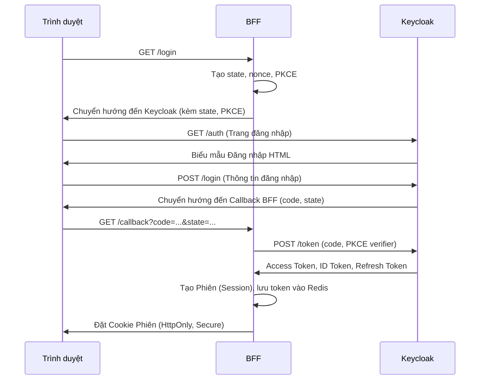
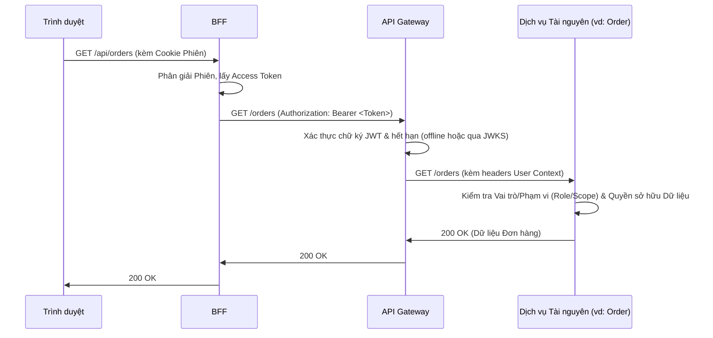
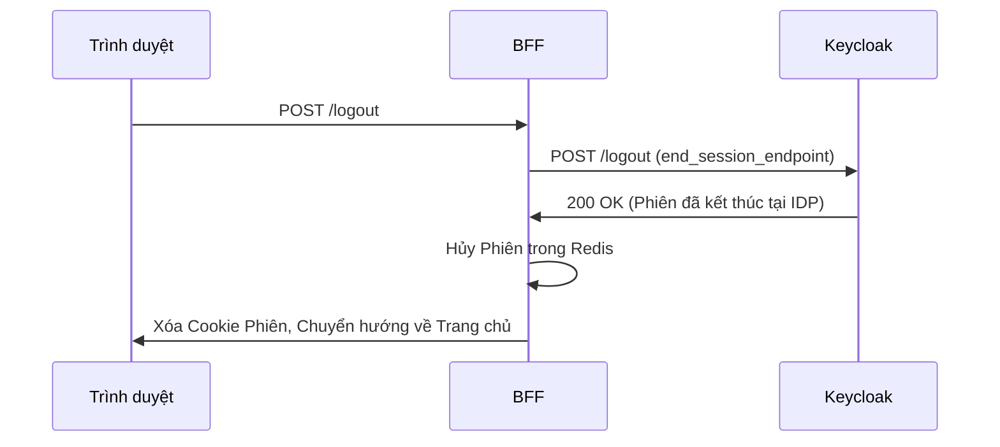

# Luồng Xác thực

## Luồng Đăng nhập

```mermaid
sequenceDiagram
    participant Browser as Trình duyệt
    participant BFF
    participant Keycloak
    
    Browser->>BFF: GET /login
    BFF->>BFF: Tạo state, nonce, PKCE
    BFF->>Browser: Chuyển hướng đến Keycloak (kèm state, PKCE)
    Browser->>Keycloak: GET /auth (Trang đăng nhập)
    Keycloak->>Browser: Biểu mẫu Đăng nhập HTML
    Browser->>Keycloak: POST /login (Thông tin đăng nhập)
    Keycloak->>Browser: Chuyển hướng đến Callback BFF (code, state)
    Browser->>BFF: GET /callback?code=...&state=...
    BFF->>Keycloak: POST /token (code, PKCE verifier)
    Keycloak->>BFF: Access Token, ID Token, Refresh Token
    BFF->>BFF: Tạo Phiên (Session), lưu token vào Redis
    BFF->>Browser: Đặt Cookie Phiên (HttpOnly, Secure)
```

## Luồng Gọi API Đã xác thực

```mermaid
sequenceDiagram
    participant Browser as Trình duyệt
    participant BFF
    participant Gateway as API Gateway
    participant Resource as Dịch vụ Tài nguyên (vd: Order)
    
    Browser->>BFF: GET /api/orders (kèm Cookie Phiên)
    BFF->>BFF: Phân giải Phiên, lấy Access Token
    BFF->>Gateway: GET /orders (Authorization: Bearer <Token>)
    Gateway->>Gateway: Xác thực chữ ký JWT & hết hạn (offline hoặc qua JWKS)
    Gateway->>Resource: GET /orders (kèm headers User Context)
    Resource->>Resource: Kiểm tra Vai trò/Phạm vi (Role/Scope) & Quyền sở hữu Dữ liệu
    Resource->>Gateway: 200 OK (Dữ liệu Đơn hàng)
    Gateway->>BFF: 200 OK
    BFF->>Browser: 200 OK
```

## Luồng Đăng xuất

```mermaid
sequenceDiagram
    participant Browser as Trình duyệt
    participant BFF
    participant Keycloak
    
    Browser->>BFF: POST /logout
    BFF->>Keycloak: POST /logout (end_session_endpoint)
    Keycloak->>BFF: 200 OK (Phiên đã kết thúc tại IDP)
    BFF->>BFF: Hủy Phiên trong Redis
    BFF->>Browser: Xóa Cookie Phiên, Chuyển hướng về Trang chủ
```
