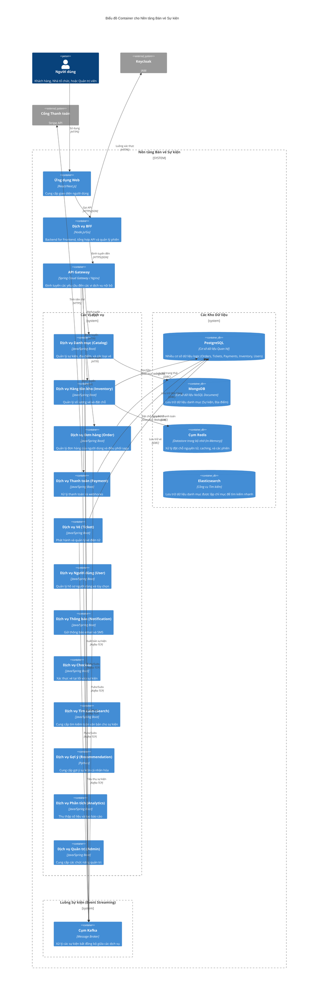

# Biểu đồ Container

```mermaid
C4Container
    title Biểu đồ Container cho Nền tảng Bán vé Sự kiện

    Person(user, "Người dùng", "Khách hàng, Nhà tổ chức, hoặc Quản trị viên")

    System_Boundary(platform, "Nền tảng Bán vé Sự kiện") {
        Container(browser, "Ứng dụng Web", "React/Next.js", "Cung cấp giao diện người dùng")
        Container(bff, "Dịch vụ BFF", "Node.js/Go", "Backend for Frontend, tổng hợp API và quản lý phiên")
        Container(api_gateway, "API Gateway", "Spring Cloud Gateway / Nginx", "Định tuyến các yêu cầu đến các vi dịch vụ nội bộ")

        Boundary(microservices, "Các Vi dịch vụ") {
            Container(catalog_service, "Dịch vụ Danh mục (Catalog)", "Java/Spring Boot", "Quản lý sự kiện, địa điểm, và các loại vé")
            Container(inventory_service, "Dịch vụ Hàng tồn kho (Inventory)", "Java/Spring Boot", "Quản lý số lượng vé và đặt chỗ")
            Container(order_service, "Dịch vụ Đơn hàng (Order)", "Java/Spring Boot", "Quản lý đơn hàng của người dùng và điều phối saga")
            Container(payment_service, "Dịch vụ Thanh toán (Payment)", "Java/Spring Boot", "Xử lý thanh toán và webhooks")
            Container(ticket_service, "Dịch vụ Vé (Ticket)", "Java/Spring Boot", "Phát hành và quản lý vé điện tử")
            Container(user_service, "Dịch vụ Người dùng (User)", "Java/Spring Boot", "Quản lý hồ sơ người dùng và tùy chọn")
            Container(notification_service, "Dịch vụ Thông báo (Notification)", "Java/Spring Boot", "Gửi thông báo email và SMS")
            Container(checkin_service, "Dịch vụ Check-in", "Java/Spring Boot", "Xác thực vé tại lối vào sự kiện")
            Container(search_service, "Dịch vụ Tìm kiếm (Search)", "Java/Spring Boot", "Cung cấp tìm kiếm toàn văn bản cho sự kiện")
            Container(recommendation_service, "Dịch vụ Gợi ý (Recommendation)", "Python", "Cung cấp gợi ý sự kiện cá nhân hóa")
            Container(analytics_service, "Dịch vụ Phân tích (Analytics)", "Java/Spring Boot", "Thu thập số liệu và tạo báo cáo")
            Container(admin_service, "Dịch vụ Quản trị (Admin)", "Java/Spring Boot", "Cung cấp các chức năng quản trị")
        }

        Boundary(data_stores, "Các Kho Dữ liệu") {
            ContainerDb(postgres, "PostgreSQL", "Cơ sở dữ liệu Quan hệ", "Nhiều cơ sở dữ liệu logic (Orders, Tickets, Payments, Inventory, Users)")
            ContainerDb(mongodb, "MongoDB", "Cơ sở dữ liệu NoSQL Document", "Lưu trữ dữ liệu danh mục (Sự kiện, Địa điểm)")
            ContainerDb(redis, "Cụm Redis", "Datastore trong bộ nhớ (In-Memory)", "Xử lý đặt chỗ nguyên tử, caching, và các phiên")
            ContainerDb(elasticsearch, "Elasticsearch", "Công cụ Tìm kiếm", "Lưu trữ dữ liệu danh mục được lập chỉ mục để tìm kiếm nhanh")
        }

        Boundary(messaging, "Luồng Sự kiện (Event Streaming)") {
            Container(kafka, "Cụm Kafka", "Message Broker", "Xử lý các sự kiện bất đồng bộ giữa các dịch vụ")
        }
    }
    
    System_Ext(keycloak, "Keycloak", "IAM")
    System_Ext(stripe, "Cổng Thanh toán", "Stripe API")

    Rel(user, browser, "Sử dụng", "HTTPS")
    Rel(browser, bff, "Gọi API", "HTTPS/JSON")
    Rel(bff, api_gateway, "Định tuyến đến", "HTTPS/JSON")
    Rel(bff, keycloak, "Luồng xác thực", "HTTPS")
    
    Rel(api_gateway, catalog_service, "Định tuyến", "HTTP")
    Rel(api_gateway, inventory_service, "Định tuyến", "HTTP")
    Rel(api_gateway, order_service, "Định tuyến", "HTTP")
    Rel(api_gateway, payment_service, "Định tuyến", "HTTP")
    
    Rel(catalog_service, mongodb, "Đọc/Ghi", "Giao thức MongoDB")
    Rel(inventory_service, redis, "Đặt chỗ nguyên tử", "Giao thức Redis/Lua")
    Rel(inventory_service, postgres, "Lưu trữ trạng thái", "JDBC")
    Rel(order_service, postgres, "Lưu trữ đơn hàng", "JDBC")
    Rel(payment_service, postgres, "Lưu trữ thanh toán", "JDBC")
    Rel(ticket_service, postgres, "Lưu trữ vé", "JDBC")
    
    Rel(catalog_service, kafka, "Xuất bản sự kiện", "Kafka TCP")
    Rel(inventory_service, kafka, "Pubs/Subs", "Kafka TCP")
    Rel(order_service, kafka, "Pubs/Subs", "Kafka TCP")
    Rel(payment_service, kafka, "Pubs/Subs", "Kafka TCP")
    Rel(ticket_service, kafka, "Pubs/Subs", "Kafka TCP")
    Rel(notification_service, kafka, "Tiêu thụ sự kiện", "Kafka TCP")
    
    Rel(payment_service, stripe, "Tính tiền thẻ", "HTTPS")
```
