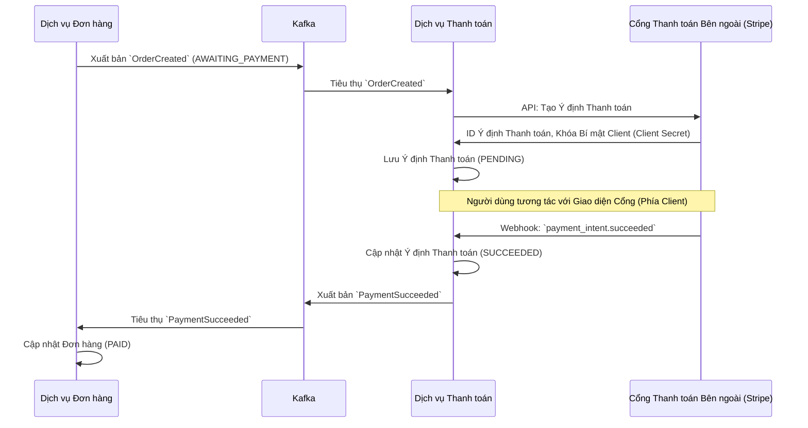
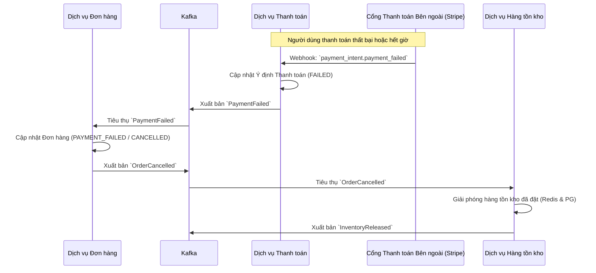
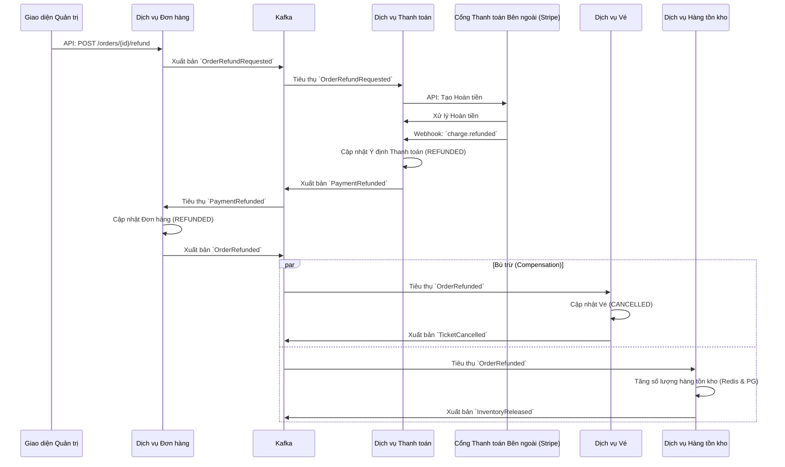

# Luồng Thanh toán

## Kịch bản Thành công (Happy Path)

```mermaid
sequenceDiagram
    participant Order as Dịch vụ Đơn hàng
    participant Kafka
    participant Payment as Dịch vụ Thanh toán
    participant Gateway as Cổng Thanh toán Bên ngoài (Stripe)

    Order->>Kafka: Xuất bản `OrderCreated` (AWAITING_PAYMENT)
    Kafka->>Payment: Tiêu thụ `OrderCreated`
    Payment->>Gateway: API: Tạo Ý định Thanh toán
    Gateway->>Payment: ID Ý định Thanh toán, Khóa Bí mật Client (Client Secret)
    Payment->>Payment: Lưu Ý định Thanh toán (PENDING)
    Note over Payment, Gateway: Người dùng tương tác với Giao diện Cổng (Phía Client)
    Gateway->>Payment: Webhook: `payment_intent.succeeded`
    Payment->>Payment: Cập nhật Ý định Thanh toán (SUCCEEDED)
    Payment->>Kafka: Xuất bản `PaymentSucceeded`
    Kafka->>Order: Tiêu thụ `PaymentSucceeded`
    Order->>Order: Cập nhật Đơn hàng (PAID)
```

## Kịch bản Thất bại (Failure Path)

```mermaid
sequenceDiagram
    participant Order as Dịch vụ Đơn hàng
    participant Kafka
    participant Payment as Dịch vụ Thanh toán
    participant Gateway as Cổng Thanh toán Bên ngoài (Stripe)
    participant Inventory as Dịch vụ Hàng tồn kho

    Note over Payment, Gateway: Người dùng thanh toán thất bại hoặc hết giờ
    Gateway->>Payment: Webhook: `payment_intent.payment_failed`
    Payment->>Payment: Cập nhật Ý định Thanh toán (FAILED)
    Payment->>Kafka: Xuất bản `PaymentFailed`
    
    Kafka->>Order: Tiêu thụ `PaymentFailed`
    Order->>Order: Cập nhật Đơn hàng (PAYMENT_FAILED / CANCELLED)
    Order->>Kafka: Xuất bản `OrderCancelled`
    
    Kafka->>Inventory: Tiêu thụ `OrderCancelled`
    Inventory->>Inventory: Giải phóng hàng tồn kho đã đặt (Redis & PG)
    Inventory->>Kafka: Xuất bản `InventoryReleased`
```

## Luồng Hoàn tiền (Refund Path)

```mermaid
sequenceDiagram
    participant Admin as Giao diện Quản trị
    participant Order as Dịch vụ Đơn hàng
    participant Kafka
    participant Payment as Dịch vụ Thanh toán
    participant Gateway as Cổng Thanh toán Bên ngoài (Stripe)
    participant Ticket as Dịch vụ Vé
    participant Inventory as Dịch vụ Hàng tồn kho

    Admin->>Order: API: POST /orders/{id}/refund
    Order->>Kafka: Xuất bản `OrderRefundRequested`
    Kafka->>Payment: Tiêu thụ `OrderRefundRequested`
    Payment->>Gateway: API: Tạo Hoàn tiền
    Gateway->>Payment: Xử lý Hoàn tiền
    Gateway->>Payment: Webhook: `charge.refunded`
    Payment->>Payment: Cập nhật Ý định Thanh toán (REFUNDED)
    Payment->>Kafka: Xuất bản `PaymentRefunded`
    
    Kafka->>Order: Tiêu thụ `PaymentRefunded`
    Order->>Order: Cập nhật Đơn hàng (REFUNDED)
    Order->>Kafka: Xuất bản `OrderRefunded`
    
    par Bù trừ (Compensation)
        Kafka->>Ticket: Tiêu thụ `OrderRefunded`
        Ticket->>Ticket: Cập nhật Vé (CANCELLED)
        Ticket->>Kafka: Xuất bản `TicketCancelled`
    and
        Kafka->>Inventory: Tiêu thụ `OrderRefunded`
        Inventory->>Inventory: Tăng số lượng hàng tồn kho (Redis & PG)
        Inventory->>Kafka: Xuất bản `InventoryReleased`
    end
```
