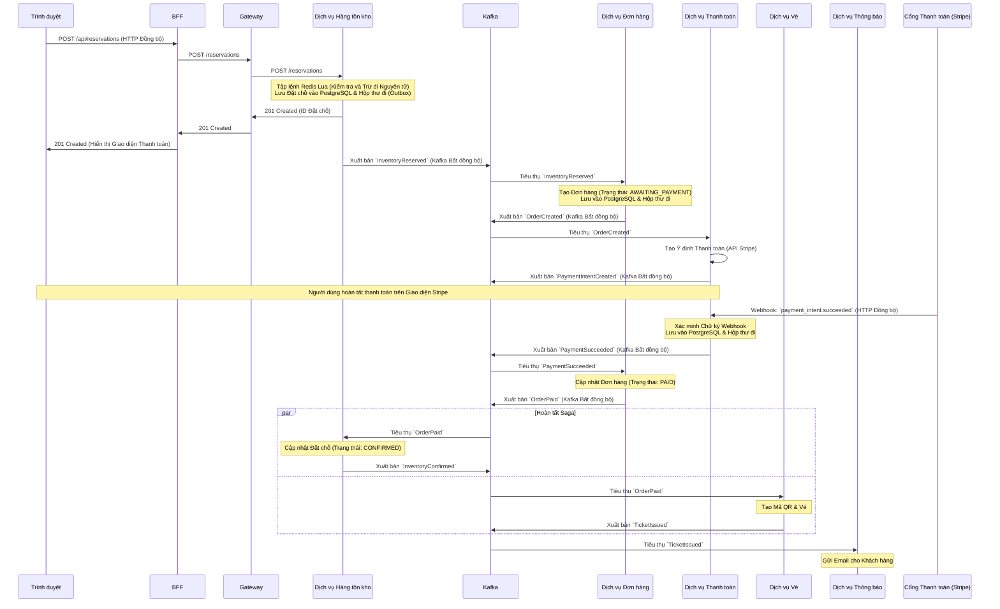

# Luồng Đặt chỗ và Mua vé

```mermaid
sequenceDiagram
    participant Browser as Trình duyệt
    participant BFF
    participant Gateway
    participant Inventory as Dịch vụ Hàng tồn kho
    participant Kafka
    participant Order as Dịch vụ Đơn hàng
    participant Payment as Dịch vụ Thanh toán
    participant Ticket as Dịch vụ Vé
    participant Notif as Dịch vụ Thông báo

    Browser->>BFF: POST /api/reservations (HTTP Đồng bộ)
    BFF->>Gateway: POST /reservations
    Gateway->>Inventory: POST /reservations
    
    Note over Inventory: Tập lệnh Redis Lua (Kiểm tra và Trừ đi Nguyên tử)<br/>Lưu Đặt chỗ vào PostgreSQL & Hộp thư đi (Outbox)
    
    Inventory->>Gateway: 201 Created (ID Đặt chỗ)
    Gateway->>BFF: 201 Created
    BFF->>Browser: 201 Created (Hiển thị Giao diện Thanh toán)
    
    Inventory->>Kafka: Xuất bản `InventoryReserved` (Kafka Bất đồng bộ)
    Kafka->>Order: Tiêu thụ `InventoryReserved`
    
    Note over Order: Tạo Đơn hàng (Trạng thái: AWAITING_PAYMENT)<br/>Lưu vào PostgreSQL & Hộp thư đi
    
    Order->>Kafka: Xuất bản `OrderCreated` (Kafka Bất đồng bộ)
    Kafka->>Payment: Tiêu thụ `OrderCreated`
    
    Payment->>Payment: Tạo Ý định Thanh toán (API Stripe)
    Payment->>Kafka: Xuất bản `PaymentIntentCreated` (Kafka Bất đồng bộ)
    
    Note over Browser, Payment: Người dùng hoàn tất thanh toán trên Giao diện Stripe
    
    participant Stripe as Cổng Thanh toán (Stripe)
    Stripe->>Payment: Webhook: `payment_intent.succeeded` (HTTP Đồng bộ)
    
    Note over Payment: Xác minh Chữ ký Webhook<br/>Lưu vào PostgreSQL & Hộp thư đi
    
    Payment->>Kafka: Xuất bản `PaymentSucceeded` (Kafka Bất đồng bộ)
    
    Kafka->>Order: Tiêu thụ `PaymentSucceeded`
    Note over Order: Cập nhật Đơn hàng (Trạng thái: PAID)
    Order->>Kafka: Xuất bản `OrderPaid` (Kafka Bất đồng bộ)
    
    par Hoàn tất Saga
        Kafka->>Inventory: Tiêu thụ `OrderPaid`
        Note over Inventory: Cập nhật Đặt chỗ (Trạng thái: CONFIRMED)
        Inventory->>Kafka: Xuất bản `InventoryConfirmed`
    and
        Kafka->>Ticket: Tiêu thụ `OrderPaid`
        Note over Ticket: Tạo Mã QR & Vé
        Ticket->>Kafka: Xuất bản `TicketIssued`
    end
    
    Kafka->>Notif: Tiêu thụ `TicketIssued`
    Note over Notif: Gửi Email cho Khách hàng
```
