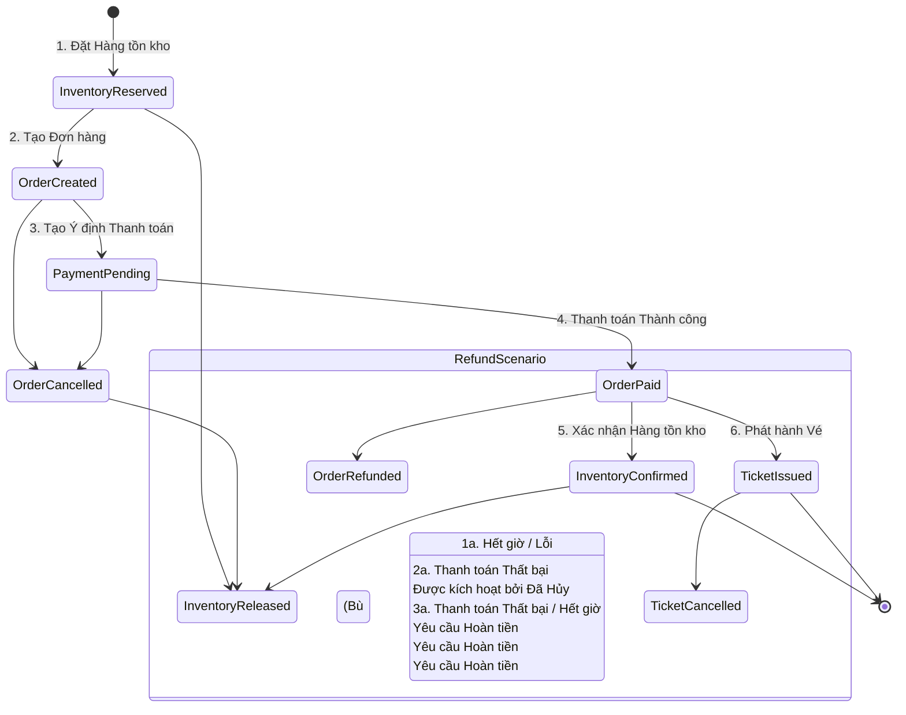

# Luồng Bù trừ Saga

Quá trình đặt vé được quản lý như một Saga phân tán. Nếu bất kỳ bước nào thất bại, các giao dịch bù trừ (compensation) sẽ được kích hoạt để khôi phục hệ thống về trạng thái nhất quán.

## Các bước Saga và Bù trừ

| Bước | Hành động | Bù trừ (Compensation) | Điều kiện kích hoạt |
|---|---|---|---|
| 1 | Đặt Hàng tồn kho (HELD) | Giải phóng Hàng tồn kho | Hết hạn đặt chỗ, Tạo đơn hàng thất bại |
| 2 | Tạo Đơn hàng (AWAITING_PAYMENT) | Hủy Đơn hàng (CANCELLED) | Thanh toán thất bại, Hết hạn thanh toán |
| 3 | Tạo Thanh toán | — (không cần bù trừ nếu chưa được xử lý) | — |
| 4 | Thanh toán Thành công → Đơn hàng PAID | Hoàn Tiền | Phát hành vé thất bại (cực kỳ hiếm, thường được thử lại thay vì bù trừ) |
| 5 | Xác nhận Hàng tồn kho | Giải phóng Hàng tồn kho | Yêu cầu hoàn tiền, Đơn hàng bị hủy sau khi thanh toán |
| 6 | Phát hành Vé | Hủy Vé | Yêu cầu hoàn tiền |

## Biểu đồ Luồng

