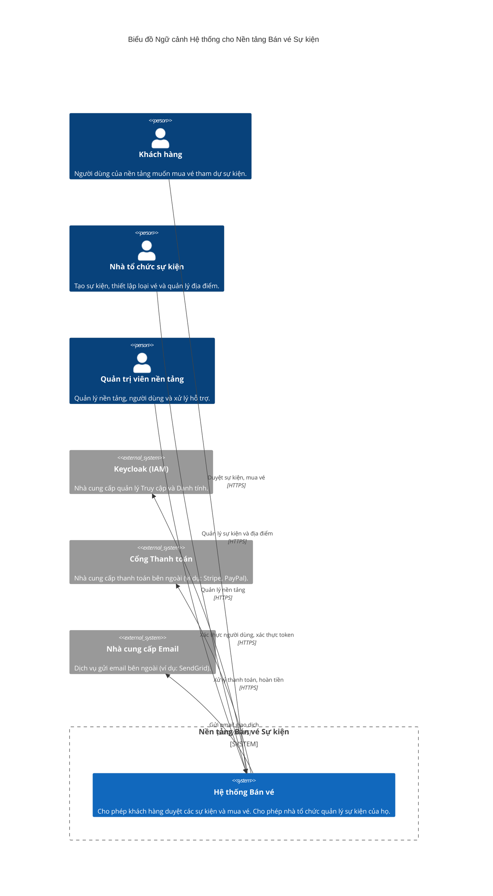

# Tổng quan Ngữ cảnh Hệ thống

Nền tảng bán vé áp dụng **kiến trúc vi dịch vụ hướng sự kiện (event-driven microservices)** để xử lý quy mô lớn và lưu lượng truy cập bùng nổ trong các đợt mở bán sự kiện phổ biến. Các vi dịch vụ cung cấp khả năng mở rộng và triển khai độc lập cho các bối cảnh cốt lõi như Hàng tồn kho (Inventory) và Đơn hàng (Order). Cách tiếp cận hướng sự kiện thông qua Kafka giúp tách rời các dịch vụ và cho phép xử lý nền bất đồng bộ cho các luồng không trọng yếu như thông báo, đồng thời ngăn chặn các kịch bản nguyên khối phân tán. Chúng tôi sử dụng **Kiến trúc Lục giác (Ports & Adapters)** cho các dịch vụ cốt lõi để tách biệt logic kinh doanh khỏi các khuôn khổ (framework) và cơ sở hạ tầng. Chiến lược lưu trữ đa nền tảng được sử dụng: **PostgreSQL** để đảm bảo tính nhất quán quan hệ chặt chẽ và tính chất ACID trong các lĩnh vực quan trọng (Đơn hàng, Thanh toán), **MongoDB** cho dữ liệu danh mục linh hoạt, đọc nhiều (Sự kiện, Địa điểm), và **Redis** cho các thao tác nguyên tử, cực kỳ nhanh chóng cần thiết để ngăn chặn việc bán quá mức (over-selling) trong quá trình đặt trước vé. Mẫu **BFF (Backend-for-Frontend)** được sử dụng cùng với API Gateway để tổng hợp các lệnh gọi và quản lý phiên an toàn cho trình duyệt, ủy quyền quản lý danh tính cho **Keycloak**. Tính **nhất quán cuối cùng (Eventual consistency)** được áp dụng qua ranh giới các dịch vụ thông qua tin nhắn bất đồng bộ, trong khi tính nhất quán mạnh mẽ được duy trì bên trong từng dịch vụ riêng lẻ. **Việc bán vé quá mức được ngăn chặn** bằng cách thực hiện các đặt chỗ nguyên tử bằng các tập lệnh Redis Lua như là bước đầu tiên của luồng đặt vé trước khi truyền tới PostgreSQL và các dịch vụ khác.

## Biểu đồ Ngữ cảnh Hệ thống

